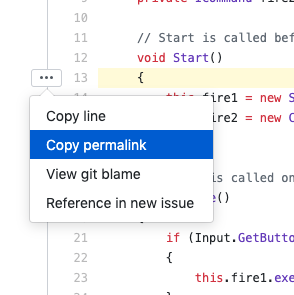

# Code Review #
## Description ##

For this assignment, you will be giving feedback on the completeness of assignment one. In order to to do so, we will be giving you a rubric to give feedback on.

If there are any questions at any point, please email the TA.   

## Solution Assessment ##

### Description ###

For assessing the solution, you will be choosing ONE choice from: unsatisfactory, satisfactory, good, great, or perfect.

The break down of each of these labels for the solution assessment.

#### Perfect #### 
    Can't find any flaws in relation to the prompt. Perfectly satisfied all stage objectives.

#### Great ####
    Minor flaws in one or two objectives. 

#### Good #####
    Major flaw and some minor flaws.

#### Satisfactory ####
    Couple of major flaws. Heading towards solution, however did not fully realize solution.

#### Unsatisfactory ####
    Partial work, not really converging to a solution. Pervasive Major flaws. Objective largely unmet.

### Stage 1 ###

- [ ] Perfect
- [ ] Great
- [ ] Good
- [ ] Satisfactory
- [ ] Unsatisfactory

#### Justifaction ##### 
Write justifaction here.

### Stage 2 ###

- [ ] Perfect
- [ ] Great
- [ ] Good
- [ ] Satisfactory
- [ ] Unsatisfactory

#### Justifaction ##### 
Write justifaction here.

### Stage 3 ###

- [ ] Perfect
- [ ] Great
- [ ] Good
- [ ] Satisfactory
- [ ] Unsatisfactory

#### Justifaction ##### 
Write justifaction here.

### Stage 4 ###

- [ ] Perfect
- [ ] Great
- [ ] Good
- [ ] Satisfactory
- [ ] Unsatisfactory

#### Justifaction ##### 
Write justifaction here.

## Code Style ##

### Description ###
Check the scripts to see if the student code adheres to the dotnet style guide.

If there are sections that don't adhere to the style guide, please peramlink the line of code from Github and justify why the line of code has infractured the style guide.

It should look something like this:

* [description of infraction] (permalink) - this is the justification.

Here is an example of the permalink drop down on Github.

### Code Style Infractures ###

#### Put style guide infractures ####

## Best Practices ##

### Description ###

If the student has followed best practices (Unity coding conventions from the StyleGuides document) then feel free to point at these segments of code as examplars. 

If the student has breached the best practices and has done something that should be noted, please add the infracture.

This should be similar to the Code Style justification.

* [description of infraction] (permalink) - this is the justification.

### Best Practice Usage ###

#### Put best practice usage here ####

### Best Practice Infractures ###

#### Put best practice infractures here ####

